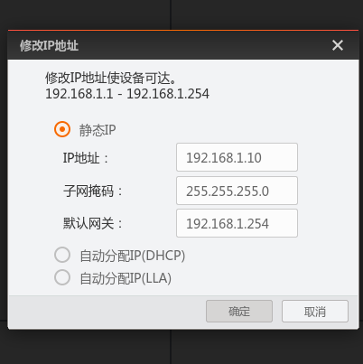

# hikcamera_ros_driver2

The **HIGH ROBUST** hikcamera_ros_driver2 is specifically designed for HIKROBOT Ethernet cameras and is compatible with ROS 1. It constructs a Hikcamera camera controller and a CameraManager for camera management. The Hikcamera integrates various camera parameter setting interfaces, as well as functions for image acquisition, format conversion, image callback, and image publishing. The CameraManager facilitates the management of multiple cameras. Currently, the library supports PTP time synchronization settings for multiple Hikvision Ethernet cameras and GigE Vision Action Command for synchronous triggering. Also added the latest HB lossless compression transfer function of Hikrobot camera.

## Features

- **GigE Vision Action Command (Requires the camera to support Action1 mode)**
  
    Send Action Command based on GigE Vision protocol to achieve synchronized triggering of multiple cameras. 
    Upon testing, the capture discrepancy among multiple cameras is approximately 0.0001 ~ 0.001 seconds for 2 MV-CS050-10GC-PRO.
  
- **HB Lossless Compression Transmission (Requires the camera to support HD compression transport mode)**

    Our tool can set the HB lossless compression transmission mode, which can reduce the transmission bandwidth usage. It is expected to reduce bandwidth usage by **1/2** compared to the original image. HB stream decoding is also integrated to restore the original image format after receiving the image.

- **Convenient Camera Parameter Settings**
- **Easier Multi-camera Management**
- **Highly Robust Camera Control and Acquisition**

    There is a high risk of packet loss for webcam data transmission. Our tool greatly avoids error exits due to packet loss or decoding failures. **Even if an error occurs, our tool will still continues to grab**.

## Dependencies

- ROS 1

- MVS Camera SDK V4.4.1 Runtime Package（Linux）

- OpenCV 4

## Build

```bash
$ mkdir -p ws_chikcamera_ros_driver2/src && cd ws_chikcamera_ros_driver2/src 
$ git clone https://github.com/QuintinUmi/hikcamera_ros_driver2.git
$ cd ../.. && catkin_make && source devel/setup.bash
```

## Usage

### a. Camera IP setting

- Pre-set the camera's ip address in the Hikvision Machine Vision Software (MVS) client.

  > MVS client download: https://www.hikrobotics.com/en/machinevision/service/download/?module=0 
  > 
  > After completing the MVS setup, be sure to disconnect the MVS from the camera

- Config Setting

    Most of parameters of hikrobot camera can be edit in [**hikcamera-param.yaml**](config/hikcamera-param.yaml) file. You may follow the MVS SDK Developer Guidance or MVS client to set the parameters.

    And in **[ros-node-config.yaml](config/ros-node-config.yaml)**, it is the config for nodes.

- Launch Multiple Camera Ros Publisher

    This function is to publish images from multiple cameras to ros server. You may use following command to launch it.

    ```bash
    $ roslaunch hikcamera_ros_driver2 multi_cam_ros_pub.launch
    ```

- Launch Multiple Camera Image Received Callback

    This part is a demo for usage of image callback. You can set your custom callback function by following the sample [**multi_cam_rcv_cb.cpp**](src/multi_cam_rcv_cb.cpp). You may use following command to launch it.

    ```bash
    $ roslaunch hikcamera_ros_driver2 multi_cam_rcv_cb.launch
    ```

